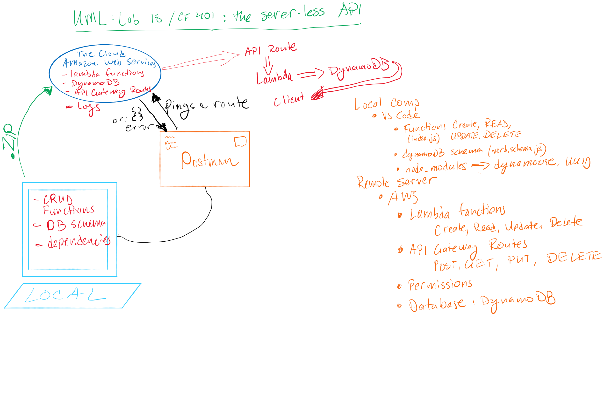

# LAB - Class 18

## Project: serverless-api

### Author: Nathan Cox

### Links and Resources

[About mocking the AWS SDK](https://www.npmjs.com/package/aws-sdk-mock)

<!-- ### Setup -->

<!-- #### `.env` requirements (where applicable) -->

#### How to initialize/run your application (where applicable)

- What is the root URL to your API?: I'm not sure. Do I have one? My gues is what you can find in the following bullet of the routes.

- What are the routes?

  - POST: https://u6nyf59w3f.execute-api.us-west-2.amazonaws.com/default/russian-verb

  - GET, PUT, DELETE: https://u6nyf59w3f.execute-api.us-west-2.amazonaws.com/default/russian-verb/{id}

- What inputs do they require?

  - To POST, you may enter the following values of a verb:
    - infinitive
    - singular forms for: I, you, s/he/it
    - plural forms for: we, you(formal), they
    - aspect: perfective or imperfective (in Russian)
    - ofMotion: boolean
  
  - To GET, PUT, or DELETE, you must enter the item's ID.

- What output do they return?

  - POST: returns a status of 200 and the new object.
  - GET: returns a status of 200 and all items in the database or the object associated with a specified ID.
  - PUT: returns status 200 and the updated object.
  - DELETE: returns a message that the verb (by name) was deleted and a status of 200.

#### How to use your library (where applicable)

#### Tests

- How do you run tests?: I couldn't figure out how to test the functions by mocking the AWS server and dynamoDB.
- Any tests of note?: N/A
- Describe any tests that you did not complete, skipped, etc.; I didn't manage to complete any.

#### UML

